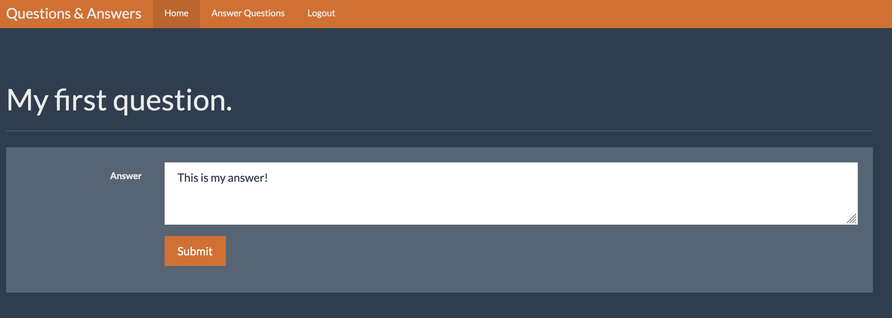
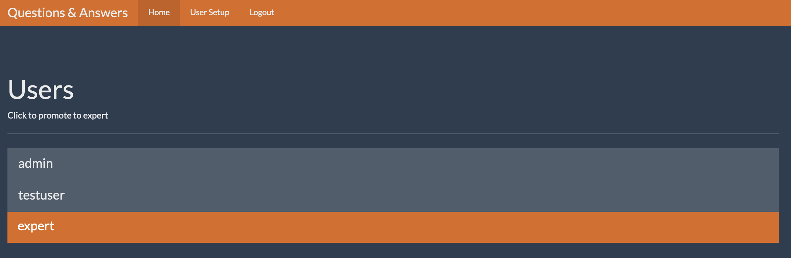

# question-and-answer-flask-app
A question and answer app based on flask and sqlite3. Users can ask questions that will be answered by an expert. There is also an admin user that is responsible for granting higher privs to users.

Users can post questions.

Experts can go into their dashboard and answer any questions intended for them.

Admin users can elevate a regular user to an expert user.

